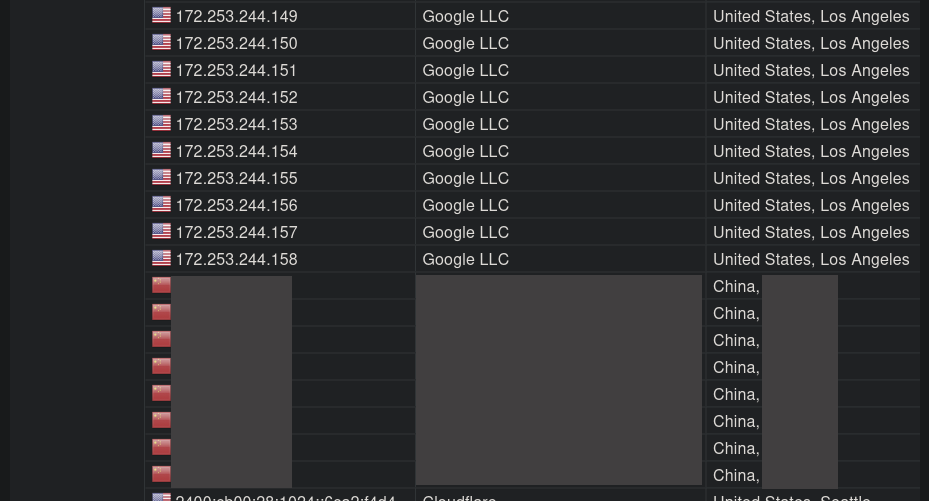
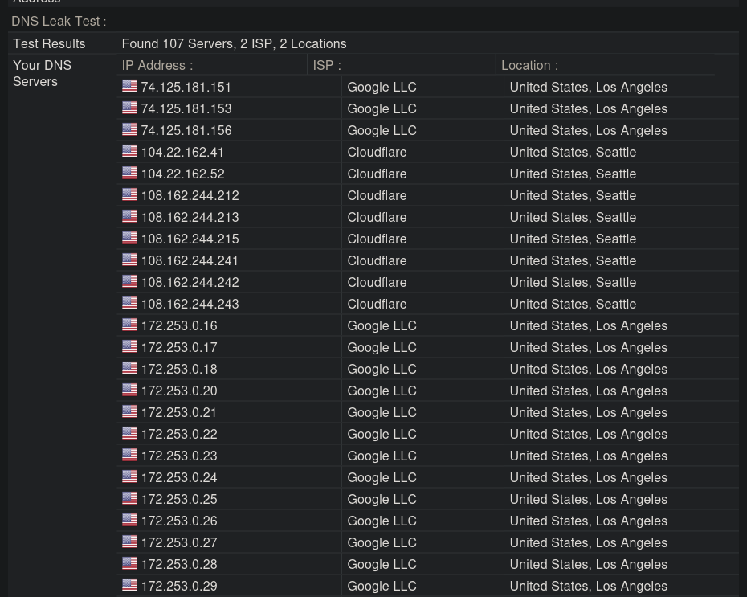

# Linux TUN system DNS configuration — verification

记录 `proxy/tun`: Linux TUN inbound 系统 DNS 接管补丁的验证过程与判定依据。用于将来向 XTLS/Xray-core 提 PR 时附带,使审查者无需真实 systemd-resolved 主机即可复现交叉编译部分。

## 补丁内容

`proxy/tun/tun_linux.go` 在 `Start()` 时把 systemd-resolved 指向 TUN 接口,在 `Close()` 时归还,对齐 `tun_windows.go` 已有的 `SetDNS` / `FlushDNS` 行为:

| 生命周期 | resolvectl 调用 |
|---|---|
| `Start()`  | `resolvectl dns <iface> <gw+1>`<br>`resolvectl domain <iface> "~."`<br>`resolvectl default-route <iface> true` |
| `Close()`  | `resolvectl revert <iface>` |

交付给系统解析器的地址是 **第一个 IPv4 gateway 加一**(如 `192.168.100.1/30` → `192.168.100.2`)。该地址属于 TUN、由 Xray 内部应答,查询才真正走隧道。**刻意不使用 `options.DNS` 的值**:若设 `resolvectl dns <iface> 1.1.1.1`,systemd-resolved 会直接经物理链路查询 `1.1.1.1` —— 恰是这个补丁要堵的泄漏。

改动范围仅 `proxy/tun/tun_linux.go`(实现)与 `proxy/tun/tun_linux_dns_test.go`(测试)。无 proto/配置变更;`options.DNS` 与 `Gateway` 本就已贯通。

## 失败处理

DNS 配置刻意非致命,永不阻塞 TUN 启动:

- 无 `resolvectl`(非 systemd 发行版)→ `exec` 返回 `exec.ErrNotFound` → 记日志,跳过
- 无 IPv4 gateway → `systemDNSAddress` 返回 `("", false)` → 跳过
- 任一 `resolvectl` 命令报错 → 记日志,TUN 照常启动
- `setSystemDNS` / `unsetSystemDNS` 通过 `systemDNSSet` 标记幂等;`ifaceName()` 守卫空 link

这保持了"无 systemd 场景"不拖垮整个接口 —— 与之前(什么都不配、DNS 由发行版处理)行为一致。

## 验证矩阵

### 1. 单元测试(`go test ./proxy/tun/`)

```
--- PASS: TestHandlerCountsTunConnectionTraffic
--- PASS: TestSetSystemDNSNoGateway
--- PASS: TestSetSystemDNSMissingResolvectl
--- PASS: TestSetSystemDNSCallsResolvectl
--- PASS: TestUnsetSystemDNSReverts
--- PASS: TestSystemDNSAddress
--- PASS: TestBuildResolvectlArgs
PASS
ok  github.com/xtls/xray-core/proxy/tun
```

单测覆盖纯逻辑(地址推导、参数拼装、幂等)与降级路径(缺 `resolvectl`、无 gateway、nil link),无需真实 systemd 主机。

### 2. 交叉编译 —— 全部 Linux 目标通过

```
GOOS=linux GOARCH=amd64 go build ./proxy/tun/   # OK
GOOS=linux GOARCH=arm64 go build ./proxy/tun/   # OK
GOOS=linux GOARCH=386   go build ./proxy/tun/   # OK
GOOS=linux GOARCH=arm   go build ./proxy/tun/   # OK
```

平台相关 DNS 代码位于 `tun_linux.go`(build-tag `linux && !android`),是跨发行版差异最大的面;四个目标全过。

### 3. 静态检查

```
gofmt -l proxy/tun/   # (empty)
go vet ./proxy/tun/   # clean
```

## 实机验证(Ubuntu 24.04, systemd-resolved + NetworkManager)

在 systemd-resolved 运行、TUN inbound 配 `gateway: ["192.168.100.1/30"]` 的真实主机上:

systemd-resolved 接受补丁的 D-Bus 写入:

```
systemd-resolved: xray_tun: Bus client set DNS server list to: 192.168.100.2
systemd-resolved: xray_tun: Bus client set search domain list to: ~.
systemd-resolved: xray_tun: Bus client set default route setting: yes
```

路由证实查询进入隧道:

```
$ ip route get 192.168.100.2
192.168.100.2 dev xray_tun src 192.168.100.1
```

`resolvectl status` 显示 TUN 已接管 DNS:

```
Link 70 (xray_tun)
    Current Scopes: DNS
         Protocols: +DefaultRoute ...
Current DNS Server: 192.168.100.2
```

`Close()` 后接口移除、DNS 回落物理网卡(`enp7s0` → 路由器 DNS),证实 revert 路径。

### 修复前:存在泄漏(browserleaks)



修复前访问 https://browserleaks.com/ip 的 DNS Leak Test,境外解析器(Google LLC / Cloudflare US)之下**混入了一整段 `China` 记录** —— 即本地 ISP 解析器。这就是系统 DNS 未经 TUN 而直接从物理网卡泄漏出去的部分。

### 修复后:泄漏消失



修复后同一测试,结果:

```
Found 107 Servers, 2 ISP, 2 Locations
  Google LLC   → 74.125.181.151 / .153 / .156, 172.253.0.16-29   United States, Los Angeles
  Cloudflare   → 104.22.162.41 / .52, 108.162.244.212-243       United States, Seattle
```

**关键判定:** 解析器全部落在境外(Google LLC US / Cloudflare US),**再无本地 ISP 或国内 DNS 解析器出现**。说明域名查询确实经 TUN 隧道出境,而非从物理网卡泄漏到本地网络。两张截图为同一环境下的修复前 / 修复后对比。

## 为何不用容器(docker/podman)测试

真实改动要触及三样东西:TUN + 内核路由接管 + 运行中的 `systemd-resolved`,而容器通常三者皆无(无 systemd 作 PID 1、无 `NET_ADMIN` 路由吸收、无 systemd-resolved)。上方的跨架构编译矩阵验证了跨发行版差异最大的构建面;Ubuntu 上实机 D-Bus 行为是权威功能验证。在此改动范围内,amd64/arm64/386/arm 编译 + 行为测试应已覆盖发行版实际差异。

## 明确不在范围(注明,未改动)

- **应用级 DoH**:自带硬编码 DNS 端点的应用仍绕过系统解析器。按 XTLS/Xray-core#6454 讨论,这是系统层修复而非应用层捕获;彻底封堵需 nftables DNAT 劫持(超出本补丁范围,Windows 也不做)。
- **`SIGKILL` 清理**:进程无法处理 `SIGKILL`,强杀会遗留 `gateway+1` 条目直到手动 `resolvectl revert`。由后续外部监督者覆盖,不在本补丁。

## 部署位置

补丁已合入外层仓库 `Xray-core` 主分支:
- 合并提交:`c8d185d2 Merge pull request #1 from youugiuhiuh/feat/tun-linux-system-dns`
- 补丁提交:`321494da proxy/tun: configure system DNS on Linux TUN inbound`

多平台 fork 备胎(未向上游提 PR,受仓库交互限制):
- `GregoryCampbellTQ/Xray-core` → `feat/tun-linux-system-dns`
- `QuincySnow/Xray-core` → `feat/tun-linux-system-dns`